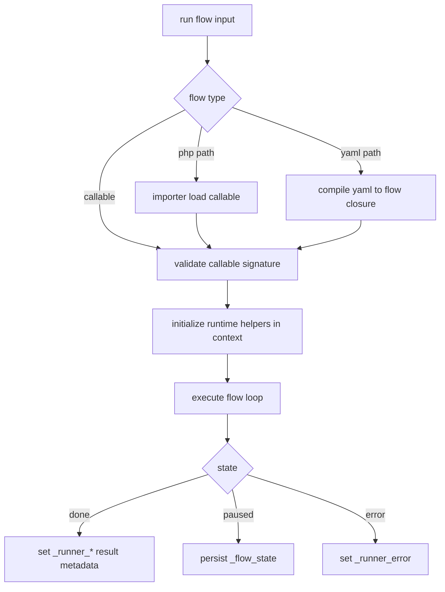

# Runtime Architecture

## Execution Pipeline

## Main Components

- `run`: prepares state, injects helpers, resolves flow input type, controls resume loop.
- `flowLoop`: executes block callables and handles jump/pause control flow.
- wrappers: `wrapCondition`, `wrapActivity`, `wrapCall`, `wrapJump`, `wrapPause`.
- importer: resolves runtime references into callables.
- YAML compiler: parses DSL and generates executable closure code.

## Mutable Context Principle

Every executable unit receives `array &$context` and mutates the same memory object. There is no immutable snapshot contract for activities.
