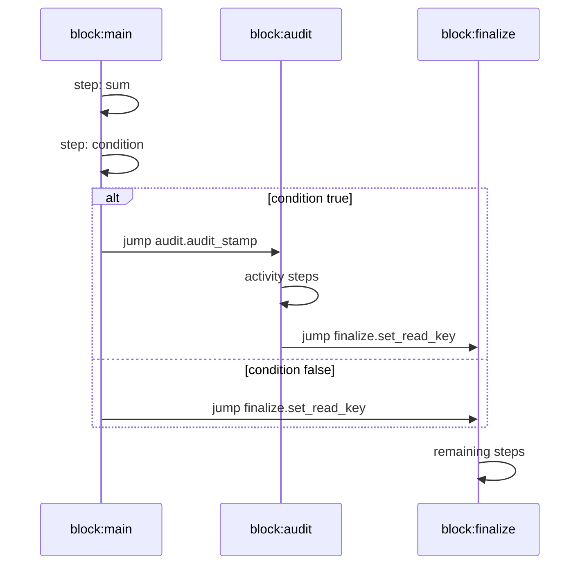

# Flow, Blocks, and Steps

## Model

A flow is defined as `flow -> blocks -> steps`.

- Blocks are named execution sections.
- Steps execute in order unless control transfer occurs (`call`, `jump`, `pause`).
- Step ids are unique per block.

## Step Behavior Summary

- `condition`: gate step execution.
- `context`: merge literal values into shared context.
- `activity`: invoke callable and store result under step id key.
- `call`: invoke another block and preserve continuation state.
- `jump`: transfer control to another block/step via jump token.
- `pause`: persist state and stop execution with pause token.

## Control Transfer Example

